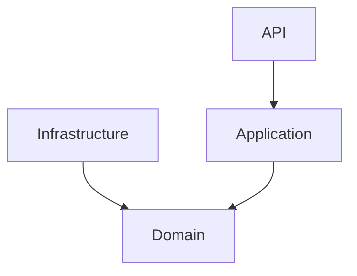

<h1 align="center">Accesia</h1>
<p align="center"><b>API RESTful de autenticación y gestión de usuarios</b></p>
<p align="center">
    <i>
        Construida con .NET 9.0 y PostgreSQL 16.<br>
        Registro, login, roles, MFA, API Keys y más.<br>
        Lista para integrarse con tus aplicaciones frontend o microservicios.
    </i>
</p>

---

## 🚀 Características

<table>
    <tr>
        <td><b>🔐 Registro y Login</b></td>
        <td><b>👤 Gestión de Usuarios</b></td>
        <td><b>🛡️ Seguridad</b></td>
        <td><b>🔑 MFA</b></td>
        <td><b>🔗 API Keys</b></td>
        <td><b>📊 Monitorización</b></td>
    </tr>
    <tr>
        <td>
            <ul>
                <li>Verificación de email</li>
                <li>Login seguro con JWT</li>
            </ul>
        </td>
        <td>
            <ul>
                <li>Perfiles editables</li>
                <li>Roles y permisos granular</li>
            </ul>
        </td>
        <td>
            <ul>
                <li>Contraseñas seguras (bcrypt)</li>
                <li>Prevención de fuerza bruta</li>
                <li>Restablecimiento de contraseña</li>
            </ul>
        </td>
        <td>
            <ul>
                <li>TOTP (Google Authenticator, Authy)</li>
                <li>Códigos de recuperación</li>
            </ul>
        </td>
        <td>
            <ul>
                <li>Generación y rotación</li>
                <li>Control de scopes</li>
            </ul>
        </td>
        <td>
            <ul>
                <li>Logs de actividad</li>
                <li>Auditoría de sesiones</li>
            </ul>
        </td>
    </tr>
</table>

---

## 🛠️ Tecnologías

<p align="center">
    
    
    
    
</p>

---

## ⚙️ Requisitos Previos

- [.NET 9.0 SDK](https://dotnet.microsoft.com/download)
- [PostgreSQL 16](https://www.postgresql.org/download/)
- [Docker & Docker Compose](https://docs.docker.com/compose/install/)

> **Nota:** Docker y Docker Compose son requeridos para ejecutar el entorno completo de Accesia.

---

## 📥 Instalación

<details>
    <summary><b>1. Clona el repositorio</b></summary>

    ```bash
    git clone https://github.com/Nekstoreo/Accesia.git
    cd Accesia
    ```
</details>

<details>
    <summary><b>2. Configura las variables de entorno</b></summary>

    Renombra `appsettings.Development.example.json` a `appsettings.Development.json` y ajusta tu conexión a PostgreSQL:

    ```json
    {
        "ConnectionStrings": {
            "Default": "Host=localhost;Port=5432;Database=AccesiaDb;Username=postgres;Password=tu_password"
        },
        "Jwt": {
            "Key": "TU_CLAVE_SECRETA_MUY_LARGA",
            "Issuer": "AccesiaAPI",
            "Audience": "AccesiaClient",
            "ExpiresInMinutes": 60
        }
    }
    ```
</details>

<details>
    <summary><b>3. Crea la base de datos y aplica migraciones</b></summary>

    ```bash
    dotnet ef database update --project src/Accesia.API
    ```
</details>

---

## ▶️ Ejecución

<details>
    <summary><b>Ejecutar la API</b></summary>

    ```bash
    cd src/Accesia.API
    dotnet run
    ```
    La API quedará escuchando en `https://localhost:5177`.
</details>

<details>
    <summary><b>Ejecutar con Docker</b></summary>

    ```bash
    docker-compose up --build
    ```
    PostgreSQL en el puerto `5432`.
</details>

> **Nota:** El uso de Docker es obligatorio para levantar todos los servicios requeridos por Accesia.

---

## 🏛️ Arquitectura



Accesia sigue principios de **Clean Architecture**:

- **Dominio**: Entidades, interfaces y lógica de negocio.
- **Aplicación**: Servicios, DTOs y validaciones.
- **Infraestructura**: Repositorios, acceso a datos y configuraciones externas.
- **Presentación (API)**: Controladores y endpoints RESTful.

---

## ✉️ Contacto

<p align="center">
    <b>Autor:</b> Néstor Gutiérrez <br>
    <a href="https://github.com/Nekstoreo">GitHub: Nekstoreo</a> <br>
    <a href="mailto:nestorg456k@outlook.com">nestorg456k@outlook.com</a>
</p>

<p align="center"><b>¡Gracias por interesarte en <span style="color:#0078D7">Accesia</span>! 🚀</b></p>
