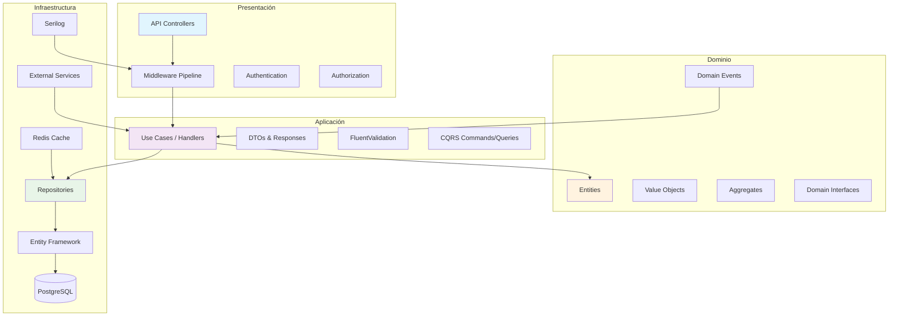

# Accesia

## Sistema de Autenticación y Gestión de Usuarios Empresarial

> **API RESTful robusta construida con .NET 9.0** siguiendo principios de **Clean Architecture** para aplicaciones
> empresariales que requieren autenticación segura, gestión de usuarios avanzada y control de acceso granular.

---

## 🗺️ **Roadmap Completo**

> 📋 **Ver [ROADMAP.md](ROADMAP.md)** para el plan detallado de desarrollo con todas las fases futuras y características empresariales.

---

## 🏗️ Arquitectura


```mermaid
graph TB
    subgraph "Presentación"
        API[API Controllers]
        MW[Middleware Pipeline]
        AUTH[Authentication]
        AUTHZ[Authorization]
    end
    
    subgraph "Aplicación"
        UC[Use Cases / Handlers]
        DTO[DTOs & Responses]
        VAL[FluentValidation]
        CQRS[CQRS Commands/Queries]
    end
    
    subgraph "Dominio"
        ENT[Entities]
        VO[Value Objects]
        AGG[Aggregates]
        INT[Domain Interfaces]
        EVT[Domain Events]
    end
    
    subgraph "Infraestructura"
        REPO[Repositories]
        EF[Entity Framework]
        SVC[External Services]
        CACHE[Redis Cache]
        DB[(PostgreSQL)]
        LOG[Serilog]
    end
    
    API --> MW
    MW --> UC
    UC --> ENT
    UC --> REPO
    REPO --> EF
    EF --> DB
    SVC --> UC
    EVT --> UC
    CACHE --> REPO
    LOG --> MW
    
    style API fill:#e1f5fe
    style UC fill:#f3e5f5
    style ENT fill:#fff3e0
    style REPO fill:#e8f5e8
```

### **Principios Arquitectónicos**

- **Clean Architecture** con separación clara de responsabilidades
- **Domain-Driven Design** con agregados ricos y eventos de dominio
- **CQRS** para operaciones complejas de lectura/escritura
- **Repository Pattern** con Unit of Work para transacciones
- **Event-Driven Architecture** para desacoplamiento
- **SOLID Principles** aplicados en todo el diseño

---

## 🛠️ Stack Tecnológico

| Categoría         | Tecnología            | Versión | Propósito                       |
|-------------------|-----------------------|---------|---------------------------------|
| **Framework**     | .NET                  | 9.0     | Runtime principal               |
| **Base de Datos** | PostgreSQL            | 16      | Almacenamiento persistente      |
| **ORM**           | Entity Framework Core | 9.0     | Mapeo objeto-relacional         |
| **Autenticación** | JWT Bearer            | -       | Tokens de acceso                |
| **Validación**    | FluentValidation      | 11.9.0  | Validación de modelos           |
| **Logging**       | Serilog               | 4.0.1   | Sistema de logs estructurado    |
| **Testing**       | xUnit + Moq           | -       | Pruebas unitarias e integración |
| **Cache**         | Redis                 | 7.0+    | Caching distribuido             |
| **Contenedores**  | Docker                | 28.0+   | PostgreSQL containerizado       |

---

## ⚙️ Instalación y Configuración

### **Prerrequisitos**

- [.NET 9.0 SDK](https://dotnet.microsoft.com/download)
- **Base de datos**: [PostgreSQL 16+](https://www.postgresql.org/download/) (local)
  o [Docker](https://docs.docker.com/compose/install/) (recomendado)

### 🚀 **Inicio Rápido**

1. **Clonar el repositorio**

```bash
git clone https://github.com/Nekstoreo/Accesia.git
cd Accesia
```

2. **Levantar PostgreSQL con Docker**

```bash
# Solo levantar la base de datos
docker-compose up postgres -d
```

3. **Configurar variables de entorno**

```bash
# Renombrar el archivo de configuración ejemplo
cp Accesia.API/appsettings.Development.example.json Accesia.API/appsettings.Development.json
```

4. **Configurar base de datos**

```json
{
  "ConnectionStrings": {
    "Default": "Host=localhost;Port=5432;Database=AccesiaDb;Username=postgres;Password=tu_password"
  },
  "Jwt": {
    "Key": "TU_CLAVE_SECRETA_SUPER_LARGA_Y_SEGURA_DE_AL_MENOS_32_CARACTERES",
    "Issuer": "AccesiaAPI",
    "Audience": "AccesiaClient",
    "ExpiresInMinutes": 60
  }
}
```

5. **Ejecutar migraciones**

```bash
dotnet ef database update --project Accesia.API
```

6. **Iniciar la API**

```bash
cd Accesia.API
dotnet run
```

> **📝 Nota**: Docker solo se usa para ejecutar PostgreSQL. La API se ejecuta directamente con .NET 9.0.

### 📦 **Instalación Alternativa (PostgreSQL Local)**

Si prefieres instalar PostgreSQL localmente:

1. Instala [PostgreSQL 16+](https://www.postgresql.org/download/)
2. Crea una base de datos llamada `AccesiaDb`
3. Ajusta la cadena de conexión en `appsettings.Development.json`
4. Continúa desde el paso 5 del inicio rápido

---

## 📚 **Documentación de API**

### **Endpoints Implementados**

#### **Autenticación**

```http
POST /api/auth/register          # Registro de usuario
POST /api/auth/verify-email      # Verificar email
POST /api/auth/resend-verification # Reenviar verificación
POST /api/auth/login             # Iniciar sesión
POST /api/auth/refresh           # Renovar token
POST /api/auth/logout            # Cerrar sesión
POST /api/auth/logout-all        # Cerrar todas las sesiones
```

#### **Gestión de Usuario**

```http
GET  /api/users/profile          # Obtener perfil
PUT  /api/users/profile          # Actualizar perfil
```

#### **Health Checks**

```http
GET  /api/health                 # Estado de la aplicación
```

### **Formato de Respuestas**

Todas las respuestas siguen un formato consistente:

```json
{
  "success": true,
  "message": "Operación completada exitosamente",
  "data": { 
    // Datos específicos del endpoint
  },
  "errors": null
}
```

### **Códigos de Estado**

- `200` - Operación exitosa
- `400` - Error de validación o datos incorrectos
- `401` - No autenticado
- `403` - Sin permisos
- `404` - Recurso no encontrado
- `429` - Rate limit excedido
- `500` - Error interno del servidor

---

## 🧪 **Testing**

```bash
# Ejecutar todas las pruebas
dotnet test

# Ejecutar con cobertura de código
dotnet test --collect:"XPlat Code Coverage"

# Pruebas por categoría
dotnet test --filter "Category=Unit"
dotnet test --filter "Category=Integration"

# Pruebas específicas
dotnet test --filter "FullyQualifiedName~LoginUser"
```

### **Estructura de Pruebas**

- **Pruebas Unitarias**: Lógica de negocio y casos de uso
- **Pruebas de Integración**: Endpoints completos con base de datos
- **Pruebas de Validación**: FluentValidation rules
- **Pruebas de Servicios**: Infraestructura y servicios externos

---

## 🔒 **Seguridad**

### **Características Implementadas**

- ✅ **Hashing seguro** con BCrypt y salt único
- ✅ **Rate limiting** por IP, usuario y endpoint
- ✅ **Validación exhaustiva** de entrada con sanitización
- ✅ **JWT tokens** con claims específicos y expiración
- ✅ **Headers de seguridad** HTTP (HSTS, CSP, X-Frame-Options)
- ✅ **Logging de auditoría** con eventos de seguridad
- ✅ **Protección CSRF** con tokens únicos

### **Próximas Características**

- 🔄 **MFA** (TOTP, SMS, Email, códigos de respaldo)
- 🔄 **OAuth 2.0** (Google, Microsoft, GitHub)
- 🔄 **Gestión de dispositivos** con fingerprinting
- 🔄 **API Keys** con scopes y rotación automática
- 🔄 **SSO empresarial** (SAML 2.0, OpenID Connect)
- 🔄 **Integración AD/LDAP** con sincronización
- 🔄 **RBAC** con permisos granulares
- 🔄 **Compliance GDPR** completo

---

## 📊 **Monitoreo y Observabilidad**

### **Logging Estructurado**

- **Serilog** con múltiples sinks (consola, archivo, base de datos)
- **Correlation IDs** para rastreo de requests
- **Contexto enriquecido** (usuario, sesión, dispositivo)
- **Niveles apropiados** (Debug, Info, Warning, Error, Fatal)

### **Métricas y Health Checks**

- **Health checks** para base de datos y servicios críticos
- **Métricas de aplicación** (requests/seg, tiempo respuesta, errores)
- **Métricas de negocio** (registros, logins, uso de características)
- **Alertas automáticas** para eventos críticos

### **Auditoría**

- **Eventos de seguridad** completos
- **Intentos de autenticación** exitosos y fallidos
- **Cambios de configuración** y perfil
- **Accesos administrativos** con contexto completo

---

## 🤝 **Contribución**

1. **Fork** el proyecto
2. **Crea** tu rama de feature (`git checkout -b feature/nueva-caracteristica`)
3. **Commit** tus cambios (`git commit -m 'feat: añadir nueva característica'`)
4. **Push** a la rama (`git push origin feature/nueva-caracteristica`)
5. **Abre** un Pull Request

### **Convenciones de Commits**

- `feat:` nueva funcionalidad
- `fix:` corrección de bug
- `docs:` cambios en documentación
- `style:` formato, sin cambios de código
- `refactor:` refactoring de código
- `test:` añadir o modificar pruebas
- `chore:` tareas de mantenimiento

### **Estándares de Código**

- **Clean Code** principles
- **SOLID** design patterns
- **Cobertura de pruebas** mínima del 80%
- **Documentación** inline para métodos públicos
- **Validación** exhaustiva de parámetros

---

## 📄 **Licencia**

Este proyecto está bajo la **Licencia MIT**. Ver [LICENSE](LICENSE) para más detalles.

---

## 👨‍💻 **Autor**

**Néstor Gutiérrez**

- 🐙 GitHub: [@Nekstoreo](https://github.com/Nekstoreo)
- 📧 Email: nestorg456k@outlook.com
- 💼 LinkedIn: [Perfil profesional](https://linkedin.com/in/nestorg456k)

---

<div align="center">

### **¿Te gusta Accesia?** ⭐

Dale una estrella al repositorio para apoyar el desarrollo

### **¿Necesitas ayuda?** 💬

Abre un [issue](https://github.com/Nekstoreo/Accesia/issues) o revisa
la [documentación](https://github.com/Nekstoreo/Accesia/wiki)

### **¿Quieres contribuir?** 🛠️

Lee nuestra [guía de contribución](#-contribución) y únete al desarrollo

---

**Construyendo el futuro de la autenticación empresarial** 🚀

</div>
